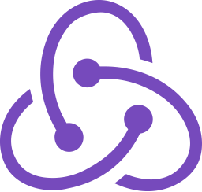
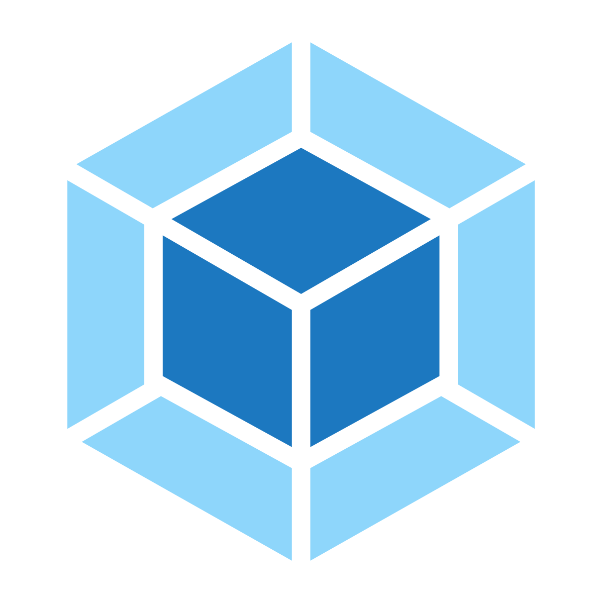
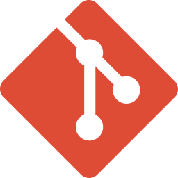
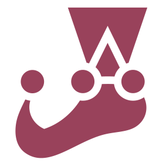
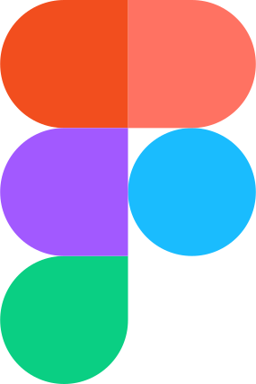
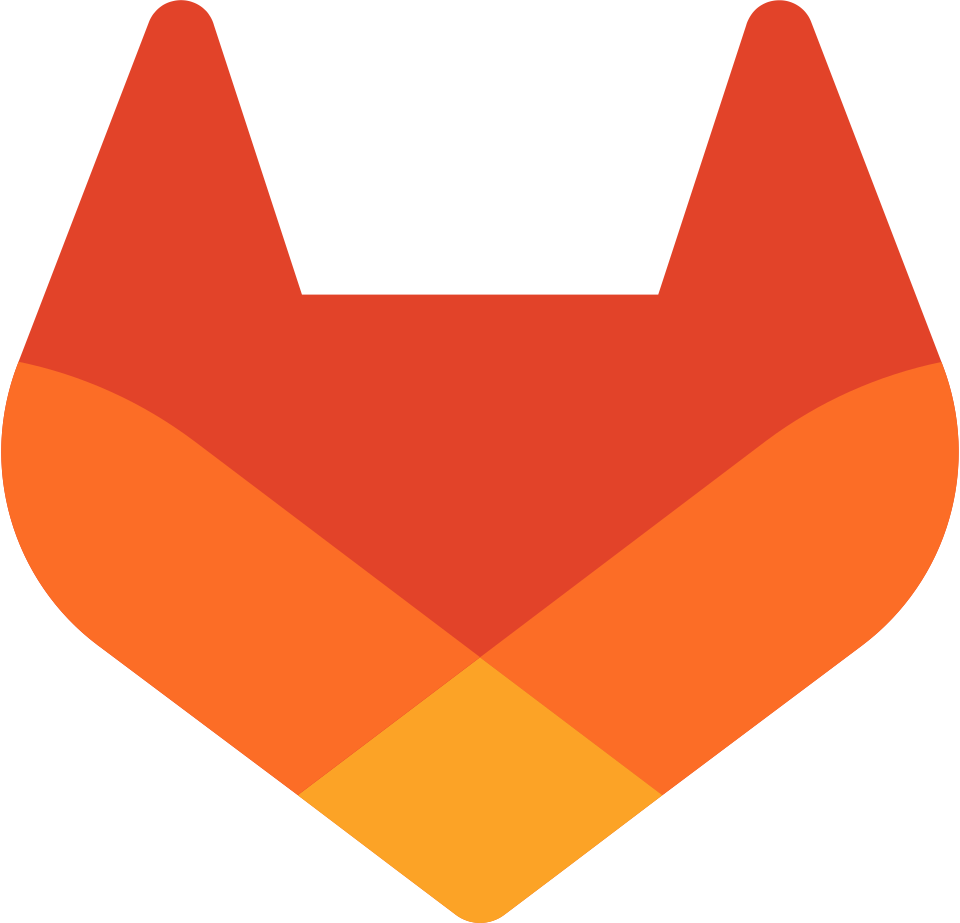

# Привет ! 👋

Меня зовут Максим, я frontend-разработчик с уклоном в TypeScript и React.

## Немного обо мне

Мой путь во Frontend начался, наверное как и у всех, с осознания того что мне интересно этим заниматься и я получаю удовольствие от достижения видимого результата (кстати именно поэтому Frontend а не Backend)

Начал в 2010 году с простой верстки сайтов, постепенно обрастал технологиями и навыками, в том числе путем прохождения курсов и на текущий момент обладаю солидным багажом знаний и умений

Имеется опыт наставничества на курсах HTML Academy (2019-2023 гг.)

## Технологии и продукты, которые я использую

    
    
    
    
    
    
    
    
    
    
    
    
    
    
    
  
  
  
    
    
    
    
    
    
    
  

## Проекты

| Название                 |                                                                                                                        | Год | Тип                                   | Описание                                                                                                 | Стек                                                                                                              |
| -------------------------------- | ---------------------------------------------------------------------------------------------------------------------- | ------ | ---------------------------------------- | ---------------------------------------------------------------------------------------------------------------- | --------------------------------------------------------------------------------------------------------------------- |
| Cat generator                    | [Repo](https://github.com/Hikikomori/cat-generator) [Deploy](https://cat-generator-9000.netlify.app)                         | 2024   | 🐈      | Генератор котиков с фильтрацией и галереей                                  | TypeScript, Next.js, Ant Design, React Hook Form, Mobx, SCSS                                                          |
| Infologistics Frontend Libraries | [Deploy](https://f-front-library-master.dev.info-logistics.eu)                                                            | 2024   | 💰     | Библиотека компонентов и стилей для проектов Infologistics                | TypeScript, React, CSS Modules, GitLab CI/CD                                                                          |
| docuForce                        | [Deploy](https://docuforce.infologistics.ru)                                                                              | 2024   | 💰     | Система электронного документооборота                                         | TypeScript, React, React Router, Redux, Axios, Formik + Yup, JEST, CSS Modules, i18n, SSE, JWT, Webpack, GitLab CI/CD |
| RM-Keeper                        | [Deploy](https://rm-keeper.infologistics.ru)                                                                              | 2023   | 💰     | Система управления единицами хранения в архивах и на складах | TypeScript, React, React Router, Redux, Axios, Formik + Yup, CSS Modules, i18n, JWT, Webpack, GitLab CI/CD            |
| GreenDocs                        | [Deploy](https://greendocs.ilsbrasil.com.br)                                                                              | 2023   | 💰     | Инструмент для подписания электронных документов                     | TypeScript, React, React Router, Redux Toolkit, Axios, Formik + Yup, CSS Modules, i18n, JWT, Webpack, GitLab CI/CD    |
| Offline Messenger                | [Repo](https://github.com/Hikikomori/React-Offline-Messenger) [Deploy](https://hikikomori.github.io/React-Offline-Messenger) | 2019   | 📊     | Чат для очень одиноких людей                                                             | JavaScript, React, PropTypes, Bootstrap, Webpack                                                                      |
| Offline Blog                     | [Repo](https://github.com/Hikikomori/React_Offline_Blog) [Deploy](https://hikikomori.github.io/React_Offline_Blog)           | 2019   | 📊     | Оффлайн блог                                                                                          | JavaScript, React, ReactRouter, PropTypes, SCSS, БЭМ, Webpack                                                      |
| Six cities                       | [Repo](https://github.com/Hikikomori/six-cities)                                                                          | 2019   | 🎓 | Сервис для поиска жилья                                                                      | TypeScript, React, React Router, Redux, Axios, Leaflet, JEST, Webpack                                                 |
| Big trip                         | [Repo](https://github.com/Hikikomori/83559-big-trip-8)                                                                    | 2019   | 🎓 | Сервис для планирования путешествий                                              | JavaScript, Chart.js, Webpack                                                                                         |
| Pink                             | [Repo](https://github.com/Hikikomori/83559-pink) [Deploy](https://hikikomori.github.io/Pink)                                 | 2017   | 🎓 | Сайт социальной сети                                                                           | HTML, SCSS, JavaScript, БЭМ, Gulp                                                                                  |
| Glaccy                           | [Repo](https://github.com/Hikikomori/83559-gllacy) [Deploy](https://hikikomori.github.io/Glaccy)                             | 2016   | 🎓 | Сайт магазина по продаже мороженого                                               | HTML, CSS, JavaScript                                                                                                 |
| Technomart                       | [Repo](https://github.com/Hikikomori/83559-technomart) [Deploy](https://hikikomori.github.io/Technomart)                     | 2015   | 🎓 | Сайт магазина инструментов                                                               | HTML, CSS, JavaScript                                                                                                 |

## Рекомендации

  

## Как со мной связаться?

✉️  [prusakov.ms@gmail.com](mailto:prusakov.ms@gmail.com)

  <a href='https://t.me/hikkomori'>@hikkomori</a>

  <a href='www.linkedin.com/in/maksim-prusakov-4865121a5'>LinkedIn</a>

