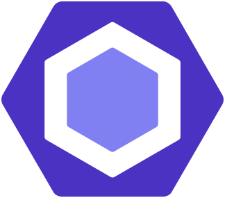

## 👋 Немного обо мне

Привет, я фронтенд-разработчик с уклоном в TypeScript и React, в профессии с 2010 года. Начинал с классической вёрстки, со временем перешёл к разработке сложных интерфейсов, архитектуре и поддержке крупных проектов.

Мне важна ясность в коде и интерфейсах. Люблю, когда результат работы понятен и ощутим — наверное, именно поэтому я выбрал фронтенд, а не бэкенд.

Спокойно встраиваюсь в команду, стараюсь быть на одной волне с коллегами и поддерживать общее качество кода. Уважаю архитектурные договорённости и не навязываю «своё видение» без веских причин.

С 2019 по 2023 год был наставником на курсах HTML Academy, помогал новичкам разобраться в основах и сделать уверенный шаг в профессию.

---

## 🛠️ Технологии и инструменты

Технологии и инструменты, которые я использую в работе:

### 🧱 Основы фронтенда

    
    
    
    
  

### ⚙️ Библиотеки и фреймворки

    
    
    
    
  

### 🎛️ UI и взаимодействие

    
    
    
    

### 📦 Сборка и CI/CD

  
    
    
    
    
    
  

### 🧑‍💻 Инструменты разработки

    
    

---

## 💻 Проекты

### 💼 Рабочие проекты
- **[docuForce](https://github.com/Hikikomori/docuforce)** (2024)  
  Система электронного документооборота с поддержкой маршрутов согласования и различными типами ЭП.
  _TypeScript, React, React Router, Redux, Axios, Formik + Yup, JEST, CSS Modules, i18n, SSE, JWT, Webpack, GitLab CI/CD_

- **[RMKeeper](https://github.com/Hikikomori/rmkeeper)** (2023)  
  Система управления физическим архивным хранением документов и логистикой.
  _TypeScript, React, React Router, Redux, Axios, Formik + Yup, CSS Modules, i18n, JWT, Webpack, GitLab CI/CD_

- **[GreenDocs](https://github.com/Hikikomori/greendocs)** (2023)  
  Инструмент для подписания и маршрутизации электронных документов.
  _TypeScript, React, React Router, Redux Toolkit, Axios, Formik + Yup, CSS Modules, i18n, JWT, Webpack, GitLab CI/CD_

- **[Infologistics Frontend Libraries](https://github.com/Hikikomori/frontend-libraries)** (2024)  
  Внутренняя библиотека UI-компонентов, использовавшаяся во всех продуктах Infologistics. 
  _TypeScript, React, SCSS Modules, React Styleguidist_

### 🐈 Pet-проекты
- **[Cat Generator 9000](https://github.com/Hikikomori/cat-generator)** (2024)  
  Одностраничное приложение для генерации котиков с фильтрами и галереей.  
  _TypeScript, Next.js, Ant Design, React Hook Form, Mobx, SCSS_

### 📊 Тестовые проекты
- **[Offline Messenger](https://github.com/Hikikomori/React-Offline-Messenger)** (2019)  
  Шутливый оффлайн-чат "для очень одиноких людей". Работает в браузере без сервера.  
  _JavaScript, React, PropTypes, Bootstrap, Webpack_

- **[Offline Blog](https://github.com/Hikikomori/React_Offline_Blog)** (2019)  
  Небольшой оффлайн-блог с возможностью переключения между постами и темами.  
  _JavaScript, React, ReactRouter, PropTypes, SCSS, БЭМ, Webpack_

### 🎓 Учебные проекты
- **[Six Cities](https://github.com/Hikikomori/six-cities)** (2019)  
  Сервис поиска жилья с картой и авторизацией.  
  _TypeScript, React, React Router, Redux, Axios, Leaflet, JEST, Webpack_

- **[Big Trip](https://github.com/Hikikomori/83559-big-trip-8)** (2019)  
  Планировщик путешествий с фильтрами и статистикой.  
  _JavaScript, Chart.js, Webpack_

### 🗂️ Архив учебных проектов (2015–2017)
Ранние учебные проекты по вёрстке и основам JavaScript.

- [Technomart](https://github.com/Hikikomori/83559-technomart) — вёрстка сайта интернет-магазина (2015)
- [Glaccy](https://github.com/Hikikomori/83559-gllacy) — сайт-магазин мороженого (2016)
- [Pink](https://github.com/Hikikomori/83559-pink) — адаптивный сайт социальной сети (2017)

---

## 💬 Рекомендации

> _Максим продемонстрировал себя как выдающийся специалист в области фронтенд-разработки. Он не только выполнял самые сложные и критически важные задачи, но и оказывал значительное влияние на производительность и качество приложений._
>
> _Отличительной чертой Максима является его продуктовый подход: он предлагал решения, участвовал в их реализации и в критические моменты заменял меня в качестве тимлида._
>
> — **Олег Петров**, тимлид, Infologistics

📄 [Полный текст рекомендательного письма (PDF)](assets/files/Reference%20Infologistics.pdf)

---

## 📫 Контакты

- ✉️ [prusakov.ms@gmail.com](mailto:prusakov.ms@gmail.com)
- 💬 [@hikikomori (Telegram)](https://t.me/hikikomori)
- 🔗 [LinkedIn](https://linkedin.com/in/maksim-prusakov-4865121a5)
